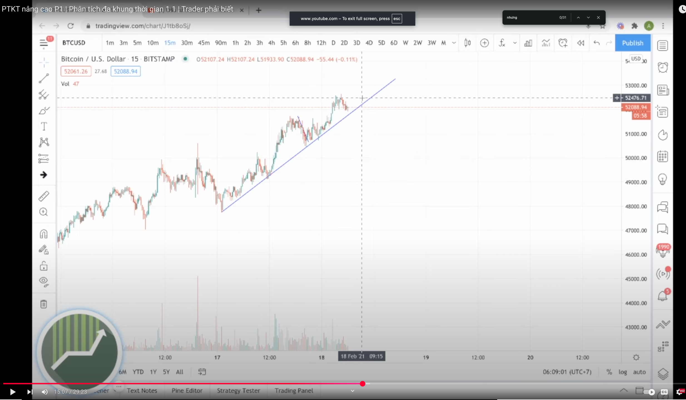
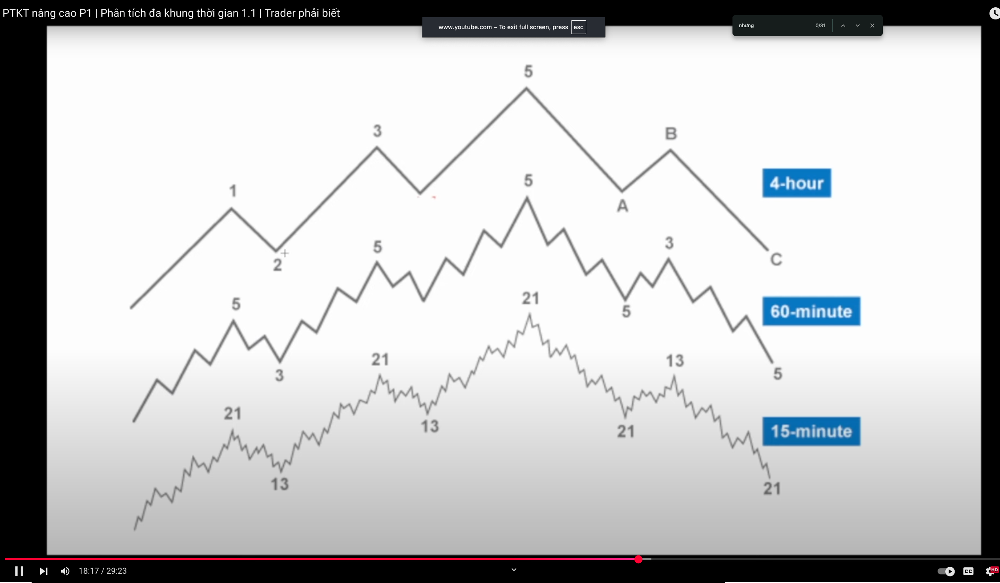

# Module 03 — Multi-Timeframe (MTF) Consensus

> Mục tiêu: đọc đồng thuận xu hướng giữa khung lớn (1W/3D/1D) → khung trung gian (4H) → khung vào lệnh (1H/15m), chỉ giao dịch **thuận xu hướng** và tránh nhiễu.

---

## 1) Vì sao cần MTF?
- **Khung lớn (HTF: 1W/3D/1D)** = Bản đồ xu hướng, vùng S/R lớn, nơi đặt kỳ vọng và kịch bản chính.
- **Khung trung gian (CT: 4H)** = Cầu nối: gom sóng hồi, bó hẹp/sideways, điểm chờ “giá về vùng”.
- **Khung vào lệnh (ET: 1H/15m)** = Timing cụ thể: chọn điểm vào/ra, đặt SL/TP tối ưu.

Khi HTF và CT **đồng thuận**, xác suất ở ET tăng mạnh. Khi **bất đồng**, ưu tiên **đứng ngoài**.

---

## 2) Khung tham chiếu chuẩn
- **HTF (1W/3D/1D):** xác định xu hướng (đỉnh/đáy cao dần hoặc thấp dần), vẽ vùng **support/resistance** chính, đường xu hướng, kênh giá.
- **CT (4H):** theo dõi **cấu trúc hồi/tiếp diễn**: phá vỡ đỉnh/đáy gần nhất, biên range, vùng cân bằng (mid-range).
- **ET (1H/15m):** chờ **pullback** về vùng của CT/HTF rồi canh tín hiệu **tiếp diễn xu hướng** bằng cấu trúc giá nhỏ (ví dụ phá đỉnh/đáy nhịp hồi).

> Ảnh minh hoạ:
>
> 
>
> 

---

## 3) Quy trình 3 bước (thực chiến)

### Bước 1 — Chọn khung vào lệnh (ET)
- Nếu bạn có thời gian theo dõi: **15m**.
- Nếu muốn nhịp vừa phải: **1H**.
- Dù chọn ET nào, vẫn **đọc HTF → CT trước**.

### Bước 2 — Đọc đồng thuận (HTF → CT)
- **Uptrend hợp lệ khi**:
  - HTF tạo **higher-high & higher-low**, giá giữ trên vùng hỗ trợ chính.
  - CT **không phá** đáy swing quan trọng gần nhất.
- **Downtrend hợp lệ khi**:
  - HTF tạo **lower-high & lower-low**, giá dưới kháng cự chính.
  - CT **không phá** đỉnh swing quan trọng gần nhất.
- **Nếu HTF và CT ngược chiều** → **không giao dịch**, chờ rõ ràng.

### Bước 3 — Lập kế hoạch lệnh (trên ET)
- **Chỉ trade thuận xu hướng HTF/CT**:
  - Uptrend: **Buy-only** hoặc **chờ buy**, không short ngược xu hướng.
  - Downtrend: **Sell-only** hoặc **chờ sell**, không long ngược xu hướng.
- **Entry:** chờ **pullback** về vùng S/R của CT; tại ET, đợi **nhịp hồi kết thúc** và **cấu trúc nhỏ** quay lại theo xu hướng (ví dụ phá đỉnh nhịp hồi để buy, phá đáy nhịp hồi để sell).
- **Stop-loss (SL):** đặt dưới/Trên **swing ET** gần nhất **hoặc** ngoài vùng S/R CT một bậc.
- **Take-profit (TP):**
  - Theo **R-multiple** (ví dụ TP1 = 1R, TP2 = 2R).
  - Kết hợp **vùng S/R kế tiếp** của CT/HTF để chốt dần.
- **Quản trị:**
  - Về **hoà vốn (BE)** khi đạt ~1R.
  - Trailing theo **đáy/đỉnh swing ET** hoặc theo biên range CT.

---

## 4) Khi nào **đứng ngoài**?
- HTF và CT **không đồng thuận**.
- CT/ET đang **sideways hẹp**, cấu trúc nhiễu (phá vỡ giả liên tục).
- Vừa xuất hiện tín hiệu **phá ngưỡng trái chiều** trên CT (vi phạm cấu trúc).

---

## 5) Checklist 10 giây (trước khi bấm lệnh)
1. Mình đang trade **thuận xu hướng HTF/CT** chứ?
2. Vùng **S/R** HTF/CT đã đánh dấu rõ?
3. ET đang là **pullback** hay **bứt phá**? Pullback đã **kết thúc** chưa?
4. **SL** ở đâu để **bảo vệ cấu trúc** mà không quá xa?
5. **TP/thoát lệnh** theo R-multiple và S/R kế tiếp đã rõ?
6. Kế hoạch **BE/Trailing**?
7. Nếu sai kịch bản, **điểm vô hiệu hoá** là gì (trên CT)?
8. Nhật ký: chụp **1W/3D/1D + 4H + ET** trước/ sau khi vào lệnh.

---

## 6) Gợi ý luyện tập
- Mỗi ngày chọn 1 thị trường, lưu 3 khung: **1D → 4H → 1H/15m**.
- Đánh dấu **vùng S/R** HTF/CT, viết **kịch bản chính/phụ**.
- Chỉ bấm lệnh khi **đủ 2 điều kiện**: (i) HTF=CT đồng thuận, (ii) ET cho pullback xong và cấu trúc quay lại theo xu hướng.

---

**Xem tiếp:** [Module 04 — Wave RSI MTF](./module04_wave_rsi_mtf.md)
